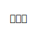

<!--
**hiraken0427/hiraken0427** is a ✨ _special_ ✨ repository because its `README.md` (this file) appears on your GitHub profile.

Here are some ideas to get you started:

- 🔭 I’m currently working on ...
- 🌱 I’m currently learning ...
- 👯 I’m looking to collaborate on ...
- 🤔 I’m looking for help with ...
- 💬 Ask me about ...
- 📫 How to reach me: ...
- 😄 Pronouns: ...
- ⚡ Fun fact: ...
-->
# Hello, World!

## 🎸 About Me

- ベースとプログラミングの人 
Programmer who loves bass and programming.

- 主に **C / C++** を書いてるよ 
Mainly writing **C / C++**.

---

### 🛠 Tech Stack

#### Main Languages

C, C++, Japanese

  &ensp;

---

#### Secondary Languages
C#, Python

  

---

#### Embedded / Systems
Arduino, Linux, Git, Bash

  

---

#### Development Environment
Windows 11, macOS, Ubuntu

  

---

### 📈 GitHub Stats 1

  

  
  

  
  

---
### 📈 GitHub Stats 2

	<picture>
	  <source media="(prefers-color-scheme: dark)"  srcset="profile-3d-contrib/profile-night-rainbow.svg" width="730" />
	  <source media="(prefers-color-scheme: light)" srcset="profile-3d-contrib/profile-season-animate.svg" width="730" />
	  
	</picture>

　

---

### 🌐 Links

[𝕏 (Twitter)](https://x.com/shiliustone)

[Qiita](https://qiita.com/hiraken0427)

---

